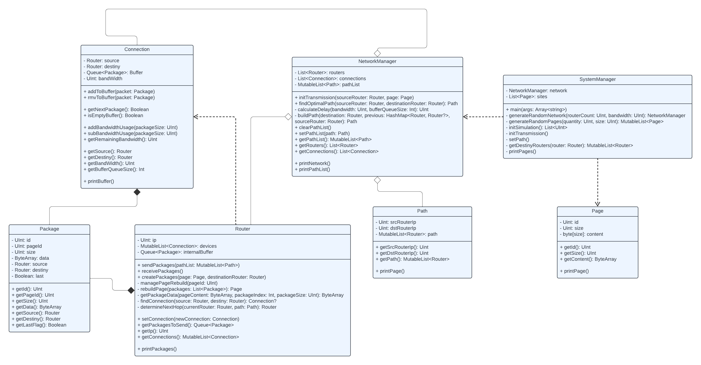

# Simulación de envío de paquetes entre routers de una red utilizando el Algoritmo de Dijkstra para buscar el camino corto.

En este proyecto se realizó la simulación del envío de paquetes entre routers de una red. A su vez, se utilizo el algoritmo de Dijkstra para buscar el camino más corto entre un router de origen y otro de destino teniendo en cuenta el ancho de banda de las conexiones.

El mismo fue realizado en lenguaje Kotlin aplicando el paradigma de programación orientado a objetos.

### Autores:
- **Bottini, Franco Nicolas**
- **Robledo, Valentin**

## ¿Cómo clonar este repositorio?

```console
git clone https://github.com/francobottini99/PR-KOTLIN-2023.git
```

> [!NOTE]
> Para poder ejecutar el programa se necesita jdk 20.

## ¿Cómo utilizar?

Vamos al directorio principal del proyecto y utilizamos el siguiente comando

```console
./gradlew run
```

Nos pedirá ingresar algunos parámetros para la simulación

```console
Numero de routers y paginas
```

```console
Tamano de la pagina
```

```console
Ancho de banda
```

```console
Numero de ciclos
```

Una vez ingresados los parámetros inicia la simulación.

### Ejemplo

Veremos un ejemplo para 3 routers, 3 páginas iniciales con un tamaño de 512, un ancho de banda de las conexiones de 256 y 12 ciclos de simulación.

Conexiones generadas:

```console
Router [1] Connections: [1 -> 2, 3 -> 1, 1 -> 3, 2 -> 1]
Router [2] Connections: [1 -> 2, 2 -> 3, 2 -> 1, 3 -> 2]
Router [3] Connections: [2 -> 3, 3 -> 1, 1 -> 3, 3 -> 2]
```

Ciclo 1, envío de paquetes:

```console
--- Cicle 1 - Task: SEND_STORE ---
Router [1] - Packet sent ID[1] from router [1] to router [3] | with destiny router [3]
Router [2] - Packet sent ID[1] from router [2] to router [3] | with destiny router [3]
Router [3] - Packet sent ID[1] from router [3] to router [2] | with destiny router [2]
```

Ciclo 2, recepción de paquetes:

```console
--- Cicle 2 - Task: RECEPTION ---
Router [1] - Empty buffer.
Router [1] - Empty buffer.
Router [2] - Empty buffer.
Router [2] - Packet stored ID[1] from router [3] with destiny router [2]
Router [2] - Reconstruct Page [1] Size [45]
Router [3] - Packet stored ID[1] from router [2] with destiny router [3]
Router [3] - Reconstruct Page [3] Size [47]
Router [3] - Packet stored ID[1] from router [1] with destiny router [3]
```

Podemos ver que la página [1] se generó de un size [45] por lo tanto se fragmentó en un único paquete y al siguiente ciclo ya se reconstruyó la misma.

## Diagrama de Clases



## Funcionamiento

A continuación se explica el funcionamiento de la simulación.

### Generación de la red

La fase inicial del proceso implica la generación de un grafo que actuará como la representación estructural de la red. Para garantizar propiedades esenciales, se impone la condición de que dicho grafo sea conexo, lo que significa que existe al menos un camino entre cualquier par de nodos en la red. Este enfoque de diseño facilita la coherencia de la simulación.

Cada nodo del grafo denota un router en la topología de la red. En este contexto, las aristas del grafo actúan como las conexiones entre routers. La asignación de pesos a estas aristas refleja el ancho de banda asociado con cada conexión.

Además, inicialmente se generan páginas como routers tenga el sistema. El peso de las mismas se establece de forma aleatoria entre 1 y el valor ingresado como parámetro.

### Inicialización de la transmisión

Una vez generada la red y las páginas iniciales, podemos iniciar con la simulación. Para cada router de la red se toma otro router de destino aleatorio y una página aleatoria para enviar. El router toma la página y la fracciona en paquetes que guarda en un buffer interno.

Luego, se generan los caminos aleatorios desde cada router a cada destino. Estos caminos más cortos se almacenan en una lista de la red donde cada router puede consultarla a la hora de realizar un envío.


### Primer ciclo - Envío de paquetes

En el primer ciclo, cada router tomará un paquete para enviar y lo colocará en el buffer de la conexión. En caso de no haber paquetes, el router simplemente esperará al próximo ciclo de envío y volverá a consultar si posee algún paquete por enviar.

### Segundo ciclo - Recepción de paquetes

Al siguiente ciclo, cada router tomará un paquete del buffer de la conexión, esto lo realiza por cada conexión que el mismo posea. El router verifica el destino del paquete, en el caso que el paquete tenga un destino diferente al router actual, irá a parar al buffer interno de envíos para ser enviado en el ciclo próximo. Caso contrario, donde el destino del paquete sea el router actual, se almacena en un buffer interno donde espera a tener todos los paquetes para reconstruir la página. En caso de tener todos los paquetes y reconstruir la página, simplemente se desecha a fin de simular el envío a una terminal.

### Próximos ciclos

En los ciclos próximos continua el envío y recepción de paquetes, uno por uno.

Para alimentar más la simulación, cada 12 ciclos se generan más páginas como routers tenga la red y se recalculan los caminos óptimos. Además, cada 6 ciclos también se recalculan los caminos óptimos en función del ancho de banda de la red.